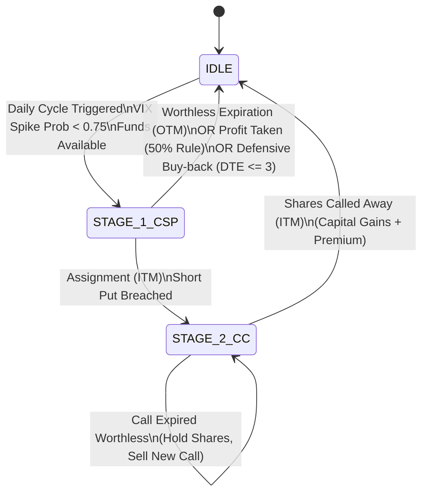
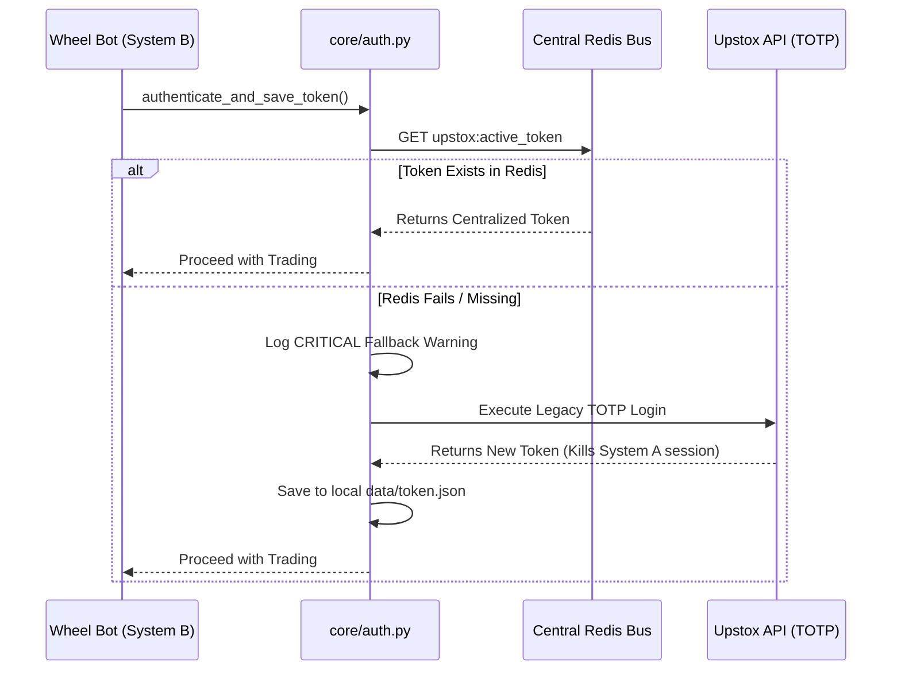

# WHEEL_STRATEGY_MANUAL

## 1. The Strategy Purpose

The Equity Options Wheel Bot is an enterprise-grade algorithmic trading system designed for consistent Theta harvesting through the mechanics of the "Wheel Strategy." The primary objective is to generate yield via defensive put credit spreads on highly liquid National Stock Exchange (NSE) equities, and mechanically manage assignments if they occur.

The bot operates on three core principles:
1. **Theta Decay (Time Value):** By selling Out-of-The-Money (OTM) options, the strategy profits as the time value of the option decays approaching expiration.
2. **Defined Risk:** Every short put position is paired with a long put (a Put Credit Spread) to strictly cap maximum potential loss and drastically reduce the margin required.
3. **The Wheel Loop:** If a short put is assigned, the bot seamlessly transitions into holding the equity (Inventory) and sells Covered Calls against it to continue generating yield until the shares are called away, completing the cycle.

---

## 2. The State Machine (IDLE -> STAGE_1_CSP -> STAGE_2_CC)

The core operations are governed by a finite state machine implemented in `strategies/wheel_strategy.py` within the `WheelStateMachine` class. The state for each equity is continuously persisted and retrieved from a PostgreSQL database (`wheel_state` table) via the `_save_state` and `_load_state` methods.

### State Transitions Diagram



### Detailed State Logic

*   **`IDLE`**: The bot holds cash.
    *   *Trigger:* APScheduler fires the daily cycle (`execute_daily_cycle`).
    *   *Action:* Checks the `VixRegimePredictor` for macro risk. If safe, selects target Put options via `_select_target_put`.
    *   *Execution:* Places a Long Put (Hedge) first, verifies the fill, then places the Short Put.
    *   *Transition:* Moves to `STAGE_1_CSP`.

*   **`STAGE_1_CSP` (Cash Secured Put / Credit Spread)**: The bot is actively managing an open Put Credit Spread.
    *   *Trigger:* Daily monitoring.
    *   *Actions:*
        *   **Defensive Trigger:** If Days To Expiry (DTE) $\le$ 3 and the spot price is below the strike (ITM), it defensively buys back the short put to prevent assignment, returning to `IDLE`.
        *   **Profit Taking:** If the current cost to close the spread drops to $\le$ 50% of the initial credit, it closes both legs and returns to `IDLE`.
        *   **Expiration:**
            *   If OTM at expiry, options expire worthless, premium is kept, state resets to `IDLE`.
            *   If ITM at expiry (Assignment), state transitions to `STAGE_2_CC`. The assigned shares and `average_cost_basis` are logged in the `inventory` dict.

*   **`STAGE_2_CC` (Covered Call)**: The bot holds assigned equity inventory and sells calls against it.
    *   *Trigger:* Assignment from `STAGE_1_CSP`.
    *   *Action:* Selects a Call option with a strike $\ge$ the `average_cost_basis` via `_select_target_call` and sells it against the held inventory.
    *   *Expiration:*
        *   If OTM, call expires worthless, premium is added to PnL, bot stays in `STAGE_2_CC` to sell another call.
        *   If ITM, shares are "called away". Realized PnL is updated with capital gains + premium, and the bot returns to `IDLE`.

---

## 3. Position Sizing & Capital Math

The bot utilizes dynamic position sizing to ensure strict adherence to capital constraints while accommodating specific equity lot sizes. This logic is handled dynamically inside `execute_daily_cycle`.

### Capital Allocation Formulas

Let $C_{avail}$ be the total available Upstox margin (`available_funds`), and $A_{pct}$ be the allocation percentage defined in the config (e.g., 0.10 for 10%).

$$ \text{Target Capital} (C_{target}) = C_{avail} \times A_{pct} $$

For a Put Credit Spread, the required margin is defined by the width of the spread multiplied by the lot size ($L$). Let $S_{short}$ be the short put strike and $S_{long}$ be the long put strike.

$$ \text{Required Capital per Lot} (C_{req}) = (S_{short} - S_{long}) \times L $$

The number of lots ($N_{lots}$) is determined by flooring the target capital against the required capital to prevent fractional lots:

$$ N_{lots} = \left\lfloor \frac{C_{target}}{C_{req}} \right\rfloor $$

Finally, the executed quantity in shares ($Q_{final}$) is:

$$ Q_{final} = N_{lots} \times L $$

### Example Scenario: INFY

*   **Assume available funds:** ₹500,000
*   **Allocation Percentage:** 10%
*   **INFY Lot Size:** 400
*   **Spot Price:** ₹1500
*   **Spread Selected:** Short ₹1450 PE / Long ₹1421 PE (2% spread width)

$$ C_{target} = 500,000 \times 0.10 = 50,000 $$
$$ C_{req} = (1450 - 1421) \times 400 = 29 \times 400 = 11,600 $$
$$ N_{lots} = \left\lfloor \frac{50,000}{11,600} \right\rfloor = \lfloor 4.31 \rfloor = 4 \text{ lots} $$
$$ Q_{final} = 4 \times 400 = 1600 \text{ shares} $$

### Edge Case: Insufficient Funds

If $C_{target} < C_{req}$, the formula results in $N_{lots} = 0$. The bot detects this edge case explicitly in `execute_daily_cycle`:
```python
if num_lots == 0:
    logger.warning("Insufficient funds to trade... Aborting.")
```
The trade is aborted gracefully, and a notification is dispatched.

---

## 4. Alpha & Risk Guardrails

The bot embeds three layers of quantitative edge to protect capital and optimize entries.

### A. The VIX ML Predictor (Circuit Breaker)

The strategy does not rely on a static VIX threshold. Instead, it utilizes an out-of-core XGBoost ML model (`VixRegimePredictor` in `ml_service/vix_inference_worker.py`).

1.  **Macro Feature Generation:** Fetches 40 days of NIFTY and INDIAVIX via Polars.
2.  **Probability Inference:** Outputs a continuous probability `vix_prob` (0.0 to 1.0) of a volatility spike.
3.  **Circuit Breaker:** If `vix_prob >= 0.75`, the bot aborts the daily cycle and stays in cash (`IDLE`).
4.  **Dynamic OTM Selection:** The `vix_prob` directly scales the aggressiveness of the Short Put strike in `_select_target_put`:
    *   `vix_prob < 0.30` $\rightarrow$ Target 2% OTM
    *   `0.30 \le vix_prob < 0.60` $\rightarrow$ Target 3% OTM
    *   `vix_prob \ge 0.60` $\rightarrow$ Target 4% OTM

*Fail-safe:* If the model fails to load or infer, it strictly returns `1.0`, forcing the bot to cash.

### B. The 15% Bid-Ask Slippage Guardrail

To prevent execution in illiquid chains, the bot evaluates the bid-ask spread of every target leg prior to order dispatch inside `_select_target_put`:

$$ \text{Spread}_{pct} = \frac{\text{Ask} - \text{Bid}}{\text{Bid}} $$

If $\text{Spread}_{pct} > 0.15$ (15%) or if the Bid is missing/zero, the trade is instantly aborted.

### C. The 50% Dynamic Profit-Taking Rule

Theta decay is non-linear. The bot captures alpha by closing positions early when rapid decay occurs, freeing capital for new cycles.

Implemented in `execute_daily_cycle` under `STAGE_1_CSP`:
1.  Calculates `initial_credit` = Short Entry Bid - Long Entry Ask.
2.  Fetches real-time prices: `current_cost_to_close` = Short Live Ask - Long Live Bid.
3.  If `current_cost_to_close <= 0.5 * initial_credit`, it executes buy-to-close (BTC) and sell-to-close (STC) orders to realize exactly 50% of the max potential profit and resets to `IDLE`.

---

## 5. Token Orchestration

Authentication with the Upstox API utilizes a resilient, active-active centralized token pipeline implemented in `core/auth.py`.

The bot does not perform raw TOTP logins by default, which would invalidate active sessions on other nodes. Instead, it relies on a shared Redis bus (`host.docker.internal:6379`).

### Token Flow Sequence



By querying `upstox:active_token`, the bot remains decentralized and purely functional as an execution node, maintaining session integrity across the broader trading infrastructure.
