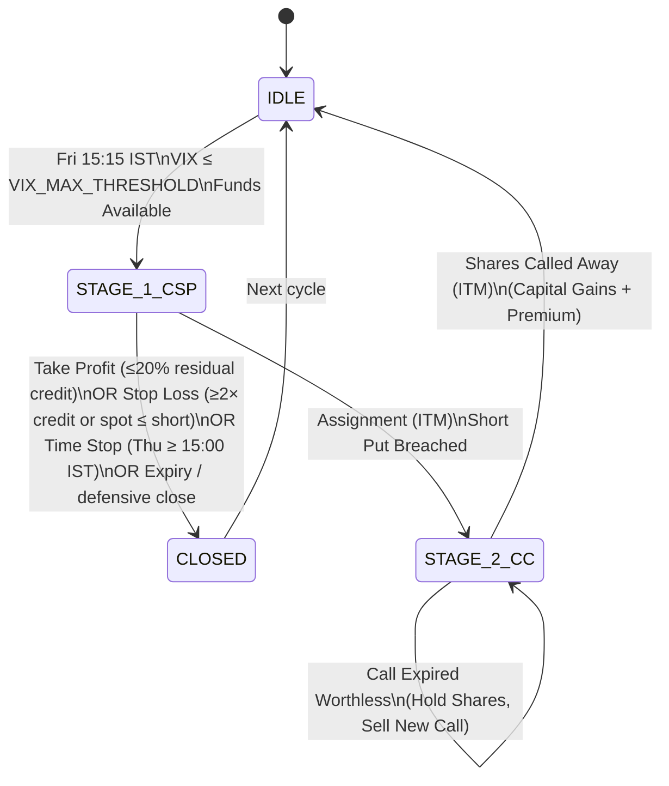
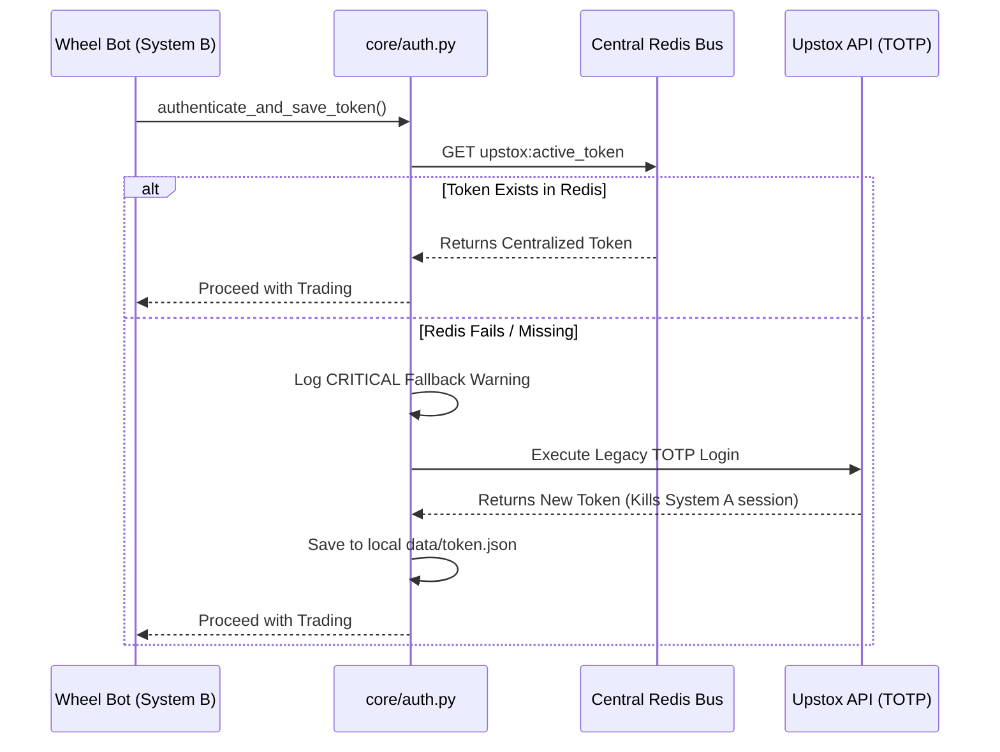

# WHEEL_STRATEGY_MANUAL

## 1. The Strategy Purpose

The Equity Options Wheel Bot is an algorithmic trading system designed for consistent Theta harvesting through the mechanics of the "Wheel Strategy." The primary objective is to generate yield via defensive put credit spreads on the NSE Nifty 50 index, and mechanically manage assignments if they occur.

The bot operates on three core principles:
1. **Theta Decay (Time Value):** By selling Out-of-The-Money (OTM) options, the strategy profits as the time value of the option decays approaching expiration.
2. **Defined Risk:** Every short put position is paired with a long put (a Put Credit Spread) to strictly cap maximum potential loss and drastically reduce the margin required.
3. **The Wheel Loop:** If a short put is assigned, the bot seamlessly transitions into holding the equity (Inventory) and sells Covered Calls against it to continue generating yield until the shares are called away, completing the cycle.

**Capital constraint:** All paper and live sizing is capped at **₹50,000** (`MAX_CAPITAL` / `PAPER_CAPITAL` in `config/settings.py`). Scheduler `allocation_pct` (Nifty 50 = 100%) therefore yields an effective budget ≤ ₹50,000.

---

## 2. The State Machine (IDLE -> STAGE_1_CSP -> STAGE_2_CC)

The core operations are governed by a finite state machine implemented in `strategies/wheel_strategy.py` within the `WheelStateMachine` class. The state for each symbol is persisted in PostgreSQL (`index_spread_state`) via `_save_state` / `_load_state`. Closed trades are archived to `trade_history`.

### State Transitions Diagram

```mermaid
stateDiagram-v2
    [*] --> IDLE

    IDLE --> STAGE_1_CSP : Fri 15:15 IST\nVIX ≤ VIX_MAX_THRESHOLD\nFunds Available

    STAGE_1_CSP --> CLOSED : Take Profit (≤20% residual credit)\nOR Stop Loss (≥2× credit or spot ≤ short)\nOR Time Stop (Thu ≥ 15:00 IST)\nOR Expiry / defensive close

    STAGE_1_CSP --> STAGE_2_CC : Assignment (ITM)\nShort Put Breached

    CLOSED --> IDLE : Next cycle

    STAGE_2_CC --> STAGE_2_CC : Call Expired Worthless\n(Hold Shares, Sell New Call)

    STAGE_2_CC --> IDLE : Shares Called Away (ITM)\n(Capital Gains + Premium)
```

### Detailed State Logic

*   **`IDLE`**: The bot holds cash.
    *   *Trigger:* APScheduler fires Friday 15:15 IST (`execute_daily_cycle`); optional mid-week when `ALLOW_MIDWEEK_ENTRY=True`.
    *   *Action:* Applies `vix_regime_otm` (skip if VIX > `VIX_MAX_THRESHOLD`). Selects target puts via delta + credit/width rules in `_select_target_put`.
    *   *Execution:* Places a Long Put (Hedge) first at mid (with requotes), verifies the fill, then places the Short Put (hedge-first).
    *   *Transition:* Moves to `STAGE_1_CSP`.

*   **`STAGE_1_CSP` (Cash Secured Put / Credit Spread)**: The bot is actively managing an open Put Credit Spread.
    *   *Triggers:* Hourly `check_exits` (Mon–Fri 09:00–15:00 IST) plus real-time WebSocket spot monitoring when market data is available (live and paper; skipped under `MOCK_MARKET`).
    *   *Exit rules* (implemented in `check_exits`, settings-driven):
        *   **Take Profit:** `cost_to_close ≤ TP_RESIDUAL_CREDIT_FRACTION × initial_credit` (default **0.25**).
        *   **Stop Loss:** `cost_to_close ≥ SL_CREDIT_MULTIPLE × initial_credit` (default **2.0**) **or** spot ≤ short strike.
        *   **Time Stop:** `TIME_STOP_WEEKDAY`/`TIME_STOP_HOUR` (default Thursday ≥ 15:00 IST).
        *   **Expiry (offline):** If expiry date has passed while the bot was down, position is closed as expired worthless (max profit assumption) → `CLOSED`.
    *   *Assignment path:* If ITM at expiry / short put breached into assignment handling, state may transition to `STAGE_2_CC` with inventory logged.

*   **`STAGE_2_CC` (Covered Call)**: The bot holds assigned equity inventory and sells calls against it.
    *   *Trigger:* Assignment from `STAGE_1_CSP`.
    *   *Action:* Selects a Call option with a strike ≥ the `average_cost_basis` via `_select_target_call` and sells it against the held inventory.
    *   *Expiration:*
        *   If OTM, call expires worthless, premium is added to PnL, bot stays in `STAGE_2_CC` to sell another call.
        *   If ITM, shares are "called away". Realized PnL is updated with capital gains + premium, and the bot returns to `IDLE`.

---

## 3. Position Sizing & Capital Math

The bot utilizes dynamic position sizing inside `execute_daily_cycle`, subject to the ₹50,000 capital ceiling.

### Capital Allocation Formulas

Let $C_{avail}$ be available margin from `client.get_available_margin()` (paper → `PAPER_CAPITAL`; live → Upstox margin **clamped to** `MAX_CAPITAL`), and $A_{pct}$ be the allocation percentage (production Nifty 50 uses `1.0`).

$$ \text{Target Capital} (C_{target}) = C_{avail} \times A_{pct} \le 50000 $$

For a Put Credit Spread, required margin is spread width × lot size ($L$):

$$ \text{Required Capital per Lot} (C_{req}) = (S_{short} - S_{long}) \times L $$

$$ N_{lots} = \left\lfloor \frac{C_{target}}{C_{req}} \right\rfloor $$

$$ Q_{final} = N_{lots} \times L $$

### Example Scenario: Nifty 50 (₹50k ceiling)

*   **Available margin (clamped):** ₹50,000
*   **Allocation Percentage:** 100%
*   **Lot Size:** 25
*   **Spread Selected:** Short put / Long put with **100-point** hedge width

$$ C_{target} = 50{,}000 \times 1.0 = 50{,}000 $$
$$ C_{req} = 100 \times 25 = 2{,}500 $$
$$ N_{lots} = \left\lfloor \frac{50{,}000}{2{,}500} \right\rfloor = 20 \text{ lots (subject to other guards)} $$

In practice lot count may be lower depending on fills, liquidity, and runtime guards; the hard rule is $C_{target} \le 50000$.

### Edge Case: Insufficient Funds

If $C_{target} < C_{req}$, then $N_{lots} = 0$. The bot aborts in `execute_daily_cycle`, logs a warning, and sends a Discord notification.

---

## 4. Alpha & Risk Guardrails

### A. VIX Regime Gate (OTM scaling + hard skip)

Entry uses `vix_regime_otm` in [`config/settings.py`](config/settings.py):

| Regime | Condition | Action | OTM |
|--------|-----------|--------|-----|
| Low | VIX < 13 | enter | 1.2% |
| Normal | 13 ≤ VIX < 18 | enter | 1.0% |
| Elevated | 18 ≤ VIX ≤ `VIX_MAX_THRESHOLD` (25) | enter | 1.5% |
| Crisis | VIX > 25 | **skip** | — |

Optional mid-week entries (`ALLOW_MIDWEEK_ENTRY`, default **False**) also require VIX in `[MIDWEEK_VIX_MIN, MIDWEEK_VIX_MAX]` (default 16–22). Friday remains the default schedule.

> **Historical note:** Earlier docs described an XGBoost `VixRegimePredictor`. That ML path is **not** used; the table above is the live mapping (PROF-010).

**Short put selection:** regime OTM band + approximate put delta nearest `SHORT_PUT_TARGET_DELTA` (default 0.18) among candidates with `credit/width ≥ MIN_CREDIT_WIDTH_RATIO` (default 0.12). Hedge at `short_strike - HEDGE_WIDTH` (default 100; must satisfy width × lot ≤ `MAX_CAPITAL`). DTE window `ENTRY_MIN_DTE`–`ENTRY_MAX_DTE` (10–42). Bid present; bid–ask ≤ `MAX_BID_ASK_SPREAD_PCT` (15%).

### B. The Bid-Ask Slippage Guardrail

Inside `_select_target_put`:

$$ \text{Spread}_{pct} = \frac{\text{Ask} - \text{Bid}}{\text{Bid}} $$

If $\text{Spread}_{pct} >$ `MAX_BID_ASK_SPREAD_PCT` or Bid is missing/zero, the trade is aborted.

### C. Exit Rules (Take Profit / Stop Loss / Time Stop)

Implemented in `check_exits` (thresholds from settings):

1. `initial_credit` = short entry − long entry.
2. `current_cost_to_close` = short live ask − long live bid.
3. **Take profit** if `current_cost_to_close ≤ TP_RESIDUAL_CREDIT_FRACTION × initial_credit` (default **0.25**).
4. **Stop loss** if `current_cost_to_close ≥ SL_CREDIT_MULTIPLE × initial_credit` (default **2.0**) or spot ≤ short strike.
5. **Time stop** if weekday == `TIME_STOP_WEEKDAY` and hour ≥ `TIME_STOP_HOUR` (default Thursday ≥ 15 IST).
6. Optional **DTE manage** when `DTE_MANAGE_THRESHOLD ≥ 0`.

**Entry pricing (PROF-012):** mid-price limits by default (`ENTRY_USE_MID_PRICE`) with limited requotes toward bid/ask; hedge-first preserved. Paper logs theoretical vs achieved credit.

> **Historical note:** Docs previously claimed a 50% take-profit and DTE≤3 defensive buy-back. Those rules are **not** present. Chosen defaults after synthetic sweep: see `docs/PROFITABILITY_ROADMAP.md` PROF-007.

---

## 5. Token Orchestration

Authentication with the Upstox API utilizes a resilient, active-active centralized token pipeline implemented in `core/auth.py`.

The bot does not perform raw TOTP logins by default, which would invalidate active sessions on other nodes. Instead, it relies on a shared Redis bus (`host.docker.internal:6379`).

### Token Flow Sequence

```mermaid
sequenceDiagram
    participant Bot as Wheel Bot (System B)
    participant Auth as core/auth.py
    participant Redis as Central Redis Bus
    participant Upstox as Upstox API (TOTP)

    Bot->>Auth: authenticate_and_save_token()
    Auth->>Redis: GET upstox:active_token

    alt Token Exists in Redis
        Redis-->>Auth: Returns Centralized Token
        Auth-->>Bot: Proceed with Trading
    else Redis Fails / Missing
        Auth->>Auth: Log CRITICAL Fallback Warning
        Auth->>Upstox: Execute Legacy TOTP Login
        Upstox-->>Auth: Returns New Token (Kills System A session)
        Auth->>Auth: Save to local data/token.json
        Auth-->>Bot: Proceed with Trading
    end
```

By querying `upstox:active_token`, the bot remains decentralized and purely functional as an execution node, maintaining session integrity across the broader trading infrastructure.
